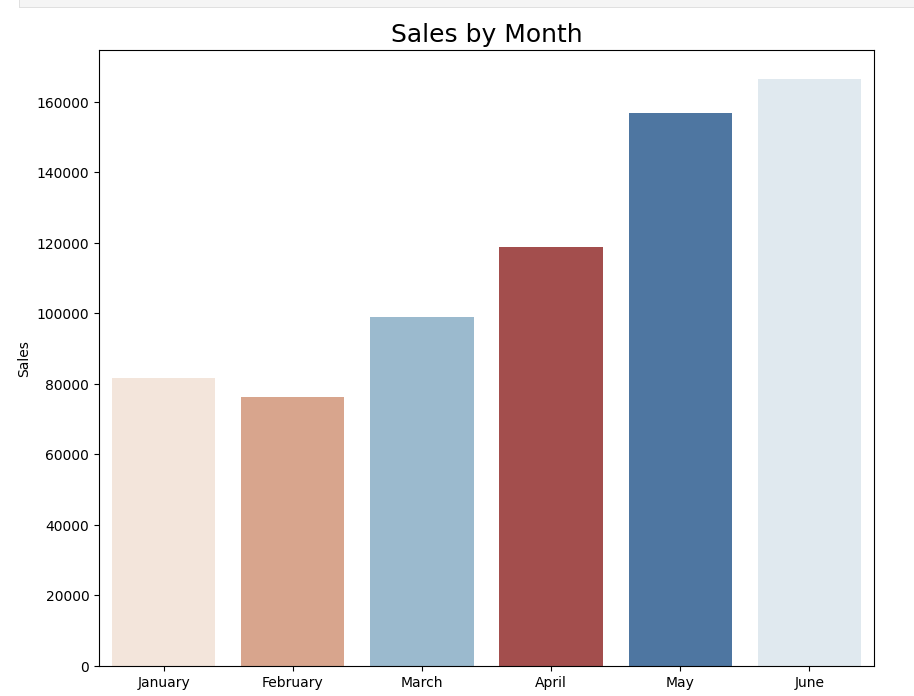
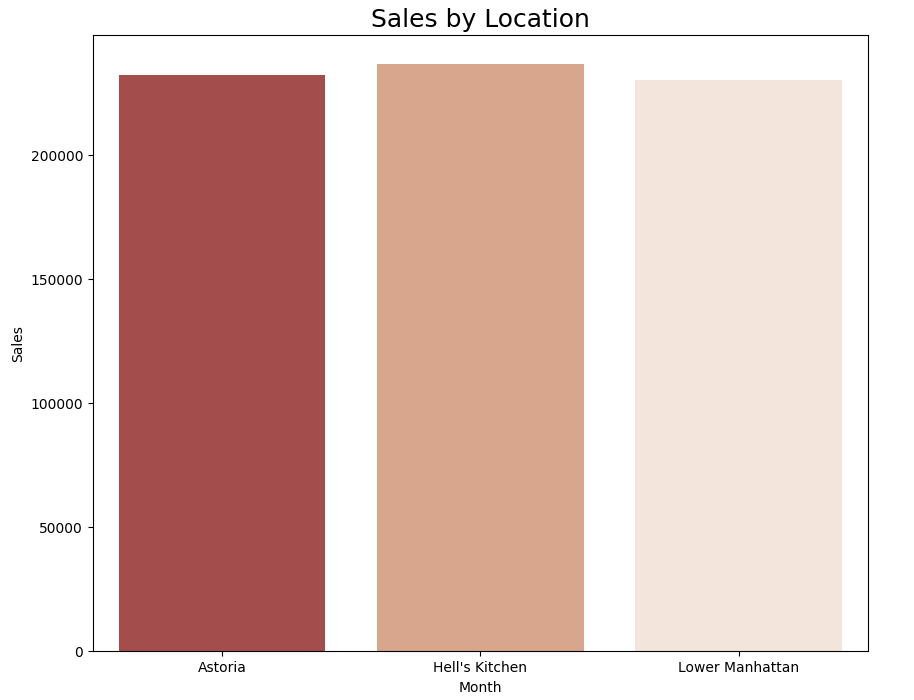
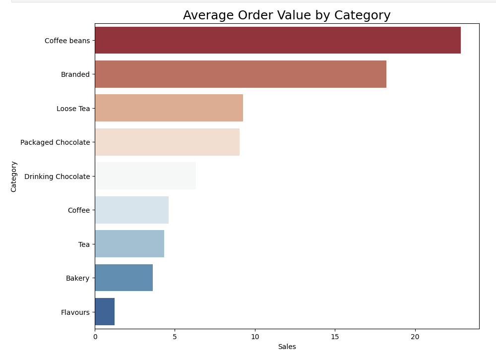
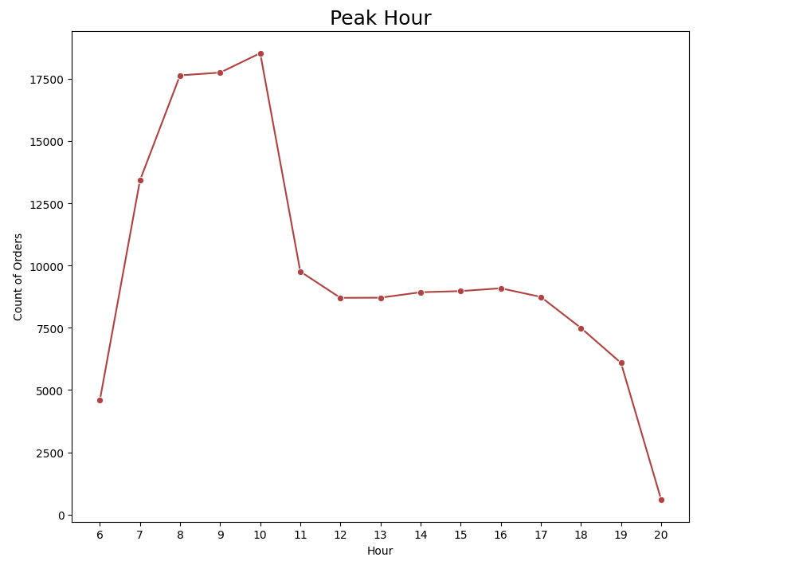

# ☕ Coffee Shop Sales Analysis using Python


---

# 📑 Table of Contents

- [Project Overview](#-project-overview)
- [Objectives](#-objectives)
- [Technologies Used](#️-technologies-used)
- [Project Structure](#-project-structure)
- [Data Cleaning & Feature Engineering](#-data-cleaning--feature-engineering)
- [Key Performance Indicators (KPIs)](#-key-performance-indicators-kpis)
- [Visualizations](#-visualizations)
- [Business Insights](#-business-insights)
- [Skills Demonstrated](#-skills-demonstrated)

---

# 📌 Project Overview

This project performs an **Exploratory Data Analysis (EDA)** on a coffee shop sales dataset to uncover customer purchasing behavior, sales trends, store performance, and product category insights.

The analysis was performed using **Python**, **Pandas**, **NumPy**, **Matplotlib**, and **Seaborn**.

---

# 🎯 Objectives

- Clean and preprocess raw sales data
- Perform exploratory data analysis (EDA)
- Identify monthly sales trends
- Compare sales across different store locations
- Analyze average order value by product category
- Identify peak customer ordering hours
- Generate business insights for decision making

---

# 🛠️ Technologies Used

- Python
- Pandas
- NumPy
- Matplotlib
- Seaborn
- Jupyter Notebook

---

# 📂 Project Structure

```text
Coffee-Shop-Sales-Analysis
│
├── data
│   ├── Coffee Shop Sales.csv
│   └── cleaned_coffee_sales_dataset.csv
│
├── notebook
│   └── EDA.ipynb
│
├── images
│   ├── banner.png
│   ├── sales_by_month.png
│   ├── sales_by_location.png
│   ├── average_orders_by_category.png
│   └── peak_hours.png
│
└── README.md
```

---

# 🧹 Data Cleaning & Feature Engineering

The dataset was prepared before analysis by:

- Removing duplicate records
- Handling missing values
- Formatting date and time columns
- Creating additional analytical features
- Preparing the data for visualization

---

# 📊 Key Performance Indicators (KPIs)

- Monthly Sales Trend
- Sales by Store Location
- Average Orders by Category
- Peak Ordering Hours

---

# 📈 Visualizations

## 📅 Sales by Month



Shows monthly sales trends and identifies the highest-performing months.

---

## 📍 Sales by Location



Compares sales across different coffee shop locations.

---

## 🛒 Average Orders by Category



Highlights customer purchasing behavior across product categories.

---

## ⏰ Peak Hours



Shows customer ordering activity throughout the day to identify peak business hours.

---

# 💡 Business Insights

- Monthly sales reveal seasonal trends.
- Store performance varies by location.
- Product categories contribute differently to sales.
- Customer traffic is concentrated during specific hours.
- The analysis provides insights to support inventory planning and staffing decisions.

---

# 🚀 Skills Demonstrated

- Python Programming
- Data Cleaning
- Exploratory Data Analysis (EDA)
- Data Visualization
- Business Analysis
- Analytical Thinking
